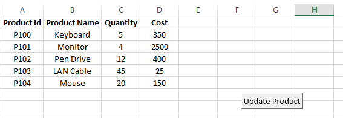
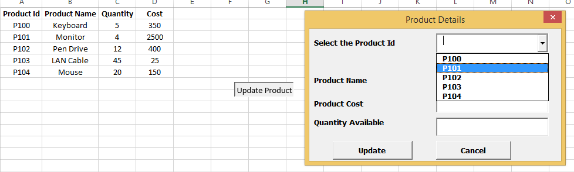
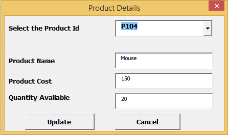
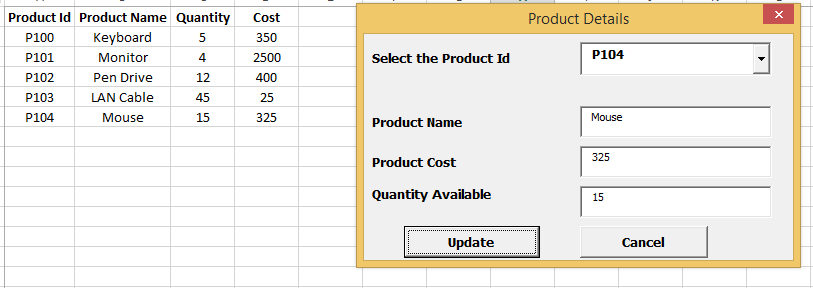

# Excel_VBA_Application

### Create an Excel based application using VBA to display the details of selected product and update the same using forms:
1. Assume that the product data is available on an Excel sheet. Add a button to update the product as shown below-

2. On clicking the button in Excel sheet, display the user form that populates all the product Ids in a combo box-

3. On changing the value in a combo box, display the respective product details-

4. Modify the product details such as cost and quantity to update the details by clicking on update button in the form. Excel sheet has to be updated accordingly as shown-

